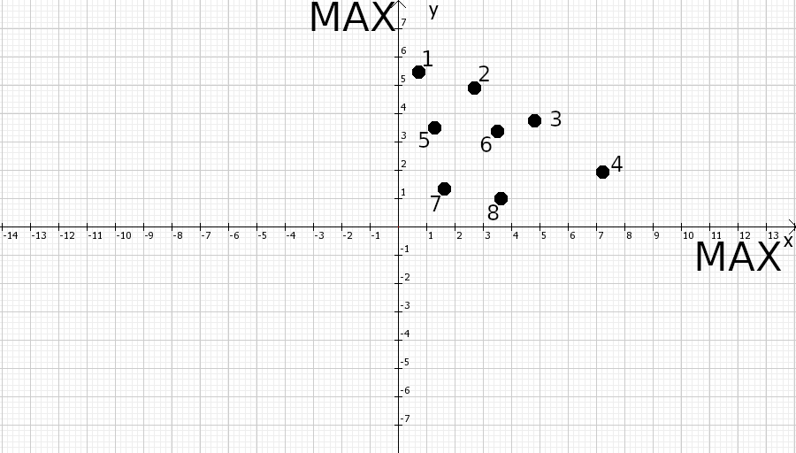

# Дискретные задачи многокритериальной оптимизации.

## Несколько начальных понятий.

1. Пусть есть множество каких-то объектов. У каждого объекта есть какие-то критерии. Наша задача - выбрать из этого множества лучшие объекты по критериям. 
3. Для каждого критерия надо выбрать, лучший "воображаемый" объект должен минимизировать его, или максимизировать.      
4. Множество Парето - такое подмножество объектов, для которых нельзя во всем множестве выбрать объект, который будет не хуже, чем они, по всем критериям.
    
### На простых примерах: 
   1. Большое и кислое яблоко | маленькое, но сладкое яюлоко.
   
   В случае, когда мы хотим и сладкое и большое яблоко, - это множество Парето.
    
   2. Дорогой, но крепкий телефон | дешевый, но хрупкий телефон. 
    
   В случае, когда наша цель минимизировать затраты и максимизироать надежность, - это множество Парето.
   
   3. Маленькая и красивая тарелка | Большая и красивая тарелка. 
   
       В случае, когда мы хотим и тарелку
       
       побольше, и чтобы кушать было приятно, это *не* множество Парето.
       
       Почему? - Потому что для маленькой и красивой тарелки можно найти тарелку лучше.
       
       **Но** в этом примере есть множество Парето. Оно состоит из одной тарелки, большой и красивой.
       
       Для нее нельзя найти тарелку, которая будет лучше по всем параметрам.
       
### Визуальное представление

   
   
   В этом примере у объектов есть два критерия, X и Y. 
   
   MAX у осей критериев означает, что чем больше значение критерия, которому принадлежит ось, тем он лучше.
   
   Рассмотрим каждую точку и определим множество Парето.
   
   Для точек 5,6,7,8 есть точка, которая лучше их по *всем* критериям. Это точка 3.
   
   Следовательно, точки 5,6,7,8 не входят в множество Парето.
   
   Для точки 1 есть точки, которые лучше ее по *только по одному* параметру. Это все точки.
   
   Но для нее нет точек, которые выше ее. Для точки 1 не оказалось точек, которые лучшее ее *по всем* параметрам.
   
   Для точки 2 нет ни одной точки, которая была бы и выше и правее нее *одновременно*, т.е для нее нет точек
   которые лучше нее по *всем* парметрам. 
   
   Следовательно точка 2 входит в множество Парето.
   
   То же касается точек 3 и 4.
   
   Итак, точки 5,6,7,8 не входят в множество Парето.
    
   Точки 1,2,3,4 - входят.
    
## Первая программа будет обрабатывать несколько точек и находить среди них множество Парето. 

## *Только для того случая, когда чем больше все критерии, тем объект желательней для нас.*

### Буду называть такой случай ALLMAX. ALL - все, MAX - максимум => максимизируем по всем параметрам.

### *Каков алгоритм?*

У каждой точки будет свой идентификатор, просто номер.

Посмотрев на мое определение 
множества Парето, можно понять, что
надо проверить для каждой точки,
есть ли точки, которые не хуже нее
по **всем** критериям. Проверять 
буду по порядку номеров.

*Буду называть такие точки просто
теми, которые лучше,а те, что
по некоторым критериям лучше,
а по некоторым - хуже, - несравнимыми.*

*Те, что не лучше по всем критериям,
буду называть худшими 
для другой точки*

Так и сделаю. Для каждой точки проверю все остальные.
Если для какой-то точки нашлась точка лучше,
то она не входит в множество, а если она
несравнима со всеми, и не хуже никакой,
то она входит в множество Парето. 

Таким образом, у меня останутся только те
точки, которые входят в множество Парето.

Посмотрим в файл pf.h

В ней функция 
find_Pareto перебирает для 
каждой точки все остальные и сравнивает их.
Для сравнения используется функция check.

В файле main.cpp в функции main
Происходит общение с пользователем
в результате которого программа получает 
количество критериев объектов и количество 
самих объектов. Потом вызывается функция
find_Pareto (описана выше) и ее
результат записывается в переменную Pareto.
Затем вызывается функция printMultitude, которая
только перебирает объекты множества и выводит их
на экран.

## Работа первой программы
---


Enter number of parameters for each object

3

Enter number of objects

5

Enter parameters of object 1

1 2 3

Enter parameters of object 2

3 2 1

Enter parameters of object 3

1 1 1

Enter parameters of object 4

2 2 5

Enter parameters of object 5

5 2 2

Pareto multitude:

2 2 5 

5 2 2 

---

## Что дальше?

### После того, как было положено начало в виде рабочей программы, появилось несколько идей для оптимизации

#### 1. Структура данных list была выбрана не просто так. В будущем можно будет оптимально по времени добавлять новые объекты к множеству.

#### 2. Кажется, что если отсортировать список по модулю векторов, образованных критериями объектов, алгоритм будет быстрее находить неподходящие множеству Парето элементы, так как если если модуль одного вектора больше, чем вектор второго, то второй точно не может быть лучше.

#### 3. Сейчас программа работает только с ALLMAX случаями. Можно свести задачи с произвольным выбором по MAX или MIN по каждому параметру к задачам ALLMAX, поменяв знак у MIN критериев на противоположный.

## Вторая программа будет сортировать точки по модулям перед поиском множества Парето и будет искать не только для MAX, но и для MIN критериев.

-----

Идея сортировать список оказалась по модулям оказалась нерабочей, так как, 
при наличии отрицательных весов, точки с меньшими модулями могут
быть лучше других, которые с большими модулями.


### Теперь программа может находить множество Парето для ALL и MAX критериев в любых количествах и комбинациях

Пример работы:

```
Enter number of parameters for each object
2

Enter number of objects
5
Enter MIN and MAX mask
MIN MAX
Enter parameters of object 1
4 6
Enter parameters of object 2
7 6
Enter parameters of object 3
4 5
Enter parameters of object 4
1 3
Enter parameters of object 5
4 6
Pareto multitude: 	
Object:	4 6 
Object:	1 3 
Object:	4 6 
```
##### Графическое представление происходящего:

Имеем такие объекты с параметрами:


Для удобства нашего представления инвертирую знак у MIN параметра (он один) и буду работать с множество, как будто случай ALLMAX.

Кстати, также происходит и в программе, но уже по соображениям алгоритмической красоты.

После инвертирования знаков получаем следующую картину:


Стоит обратить внимание, что инвертирование знака в нашем случае образует осевую симметрию относительно оси Y, что довольно красиво.

В итоге имеем точки:
```
Object: -4 6
Object: -7 6
Object: -4 5
Object: -1 3
Object: -4 6
```
На графике видно, что нет точек, которые лучше, чем:
```
Object:	-4 6 
Object:	-1 3 
Object:	-4 6 
```
Остальные хуже них по всем параметрам, что как раз подходит под определения множества Парето.
## Сокращение множества

Уверен, никто из вас не уйдет из магазина, не выбрав хлеба, если представлены разные их виды с различными ценами.

Если ваш выбор может зависеть от личных предпочтений, кошелька, настроения, погоды и прочих, иногда неожиданных факторов, 

то дискретная математика выделяет четко сформулированные способы сократить множество Парето.

Разберем некоторые классические из них. (Их можно придумать сколько угодно)

1. Указание нижних границ границ критериев
    Название говорит само за себя. Точки, которые не подходят под ограничения просто исключаются из множества.
2. Субоптимизация
    Выделяется один критерий. Для остальных критериев назначаются нижние границы. Затем выбирается элемент, 
    который максимизирует или минимизирует выбранный критерий и удобвлетворяет ограничениям по остальным критериям.
3. Лексикографическая оптимизация 
    Критерии упорядочиваются по важности. Дальше происходит поиск объекта, который лексикографически лучше, чем остальные.
4. Оптимизация с помощью обобщенного критерия
    На основе имеющихся критериев строится еще один. Обычно его просто выражают какой-то формулой через них.
    Например, в случае с хлебом можно, например, для каждого батона умножить личные предпочтения, которые будут как-то численно представлены,
    на его цену и поделить на количество солнечных дней в этом году. Таких выражений можно придумать сколько угодно.
    После вычисления обобщенного критерия для каждого объекта выбирается такой, у которого эта сумма самая большая.
    Разберем классическое выражение, *взвешенную сумму частных критериев*.
    Если есть какие-то критерии a1...an, то их взвешенная сумма это выражение вида:
    q1*a1+q2*a2+q3*a3...+qn*an
    Если какие-то критерии MIN, то коэффиценты при них q тополнительно домножаются на -1.
